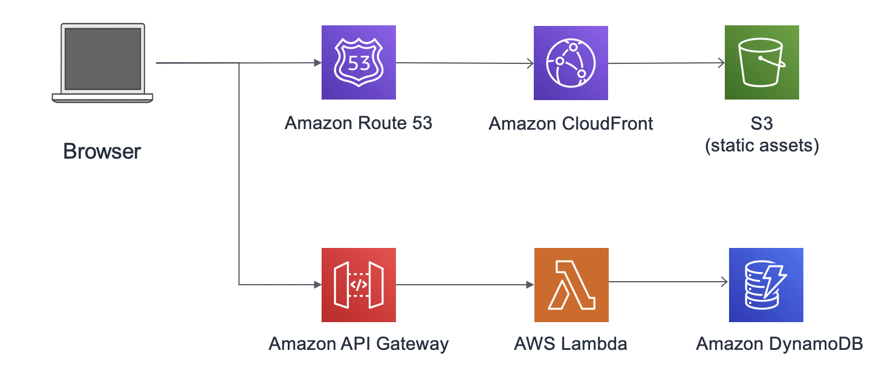
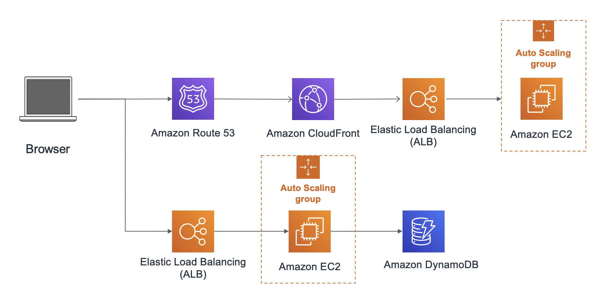
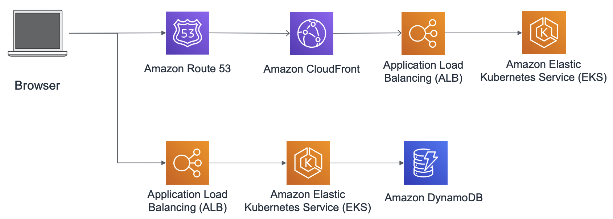

## Terraform Sample Codes for Web Hosting Architecture on AWS China region

中文版本请点击[此文档](README-cn.md)

This repo provides three types of web hosting architecture sample codes. Each of them contain a default example website, so that you could visit directly after the deployment.
1. Serverless：Cloudfront + S3 / API Gateway + Lambda + DynamoDB
2. EC2: Cloudfront - ALB - EC2 in Auto Scaling Group - DynamoDB
3. EKS: EKS for front and backend

>Note: 
>1. Terraform could be used in China region too. 
>2. If you have existing terraform scripts that apply to other global AWS regions, you need to revise the scripts to make it work.  
>3. The differences that need to revise mainly includes ARN, [service endpoint](https://docs.amazonaws.cn/en_us/aws/latest/userguide/endpoints-arns.html) and region codes etc.

## Pre-requisite 
* Install and configure [AWS CLI](https://aws.amazon.com/cn/cli/)
* Have a domain whose first domain has completed the ICP recordal process 
* Have AWS China account (if you would like to apply one, please refer to [this page](https://docs.amazonaws.cn/en_us/aws/latest/userguide/accounts-and-credentials.html#signup) for guidance)
* the AWS China account has opened the 80、8080、443 ports (blocked by default, use ICP recordal to apply for the unblock)
* Apply for SSL certificates in advanced，as Cloudfront in China region doesn't allow default domain and certificate. 
* Upload this certificates to IAM，for CloudFront to use (China region doesn't support ACM integration yet -202206 )
* We will not cover more introduction about China region in this repo, please check [this doc](https://docs.amazonaws.cn/en_us/aws/latest/userguide/what-is-aws.html) for more information if you are interested to learn more.

```
# use CLI to upload the SSL certificate 
aws iam upload-server-certificate —server-certificate-name CertificateName
--certificate-body file://public_key_certificate_file —private-key file://privatekey.pem
--certificate-chain file://certificate_chain_file —path /cloudfront/<DistributionName>/
```


## 1.  Serverless Web Hosting

Front-end: Cloudfront + S3

Back-end: API Gateway + Lambda


### Architecture



### Deployment Steps

1. Download this repo
    ```
    git clone https://github.com/aws-samples/web-hosting-architecture-examples-for-china-region-terraform.git
    cd serverless
    ```

2. revise variable.tf and replace variables with your own ones

    ```
    variable "site_domain" {
      type        = string
      description = "The domain name to use for the static site"
      default = "example.com"
    }
    
    Note: If you would like to revise the name of DynamoDB tablles, please also revise this value in lambda codes.
    ```

3. Revise cloudfront.tf, and add self-defined CNAME & certificates

    ```
    # must have a SSL certificate ready in IAM before you add alias
    aliases = [
         "xxxx.${var.site_domain}"   # assume the domain and corresponding cerficiate is example.com， "xxx.example.com"
    ]
    
    viewer_certificate {
       acm_certificate_arn = "xxxxxx"  #Cerficates ARN
       ssl_support_method  = "sni-only" 
    }
    
    Comments the codes that use the default certificate：
    # viewer_certificate {
    #    cloudfront_default_certificate = true  
    # }
    
    
    ```

4. (Optional) If your DNS host zone has already existed，and also in current AWS accounts, add the below codes to cloudfront.tf, so that terraform could add Cloudfront CNAME records. 

    ```
    # If your DNS host zone has aready existed in current AWS account, use these below codes for terraform to add the cloudfront records.
 
    data "aws_route53_zone" "my-domain" {
      name         = "${var.site_domain}"   # host zone name
      private_zone = false
    }
    
    
    resource "aws_route53_record" "terraform" {
      zone_id = data.aws_route53_zone.my-domain.zone_id
      name    = "terraform.${var.site_domain}"  # revise your own domain
      type    = "A"
      # records = [aws_s3_bucket.site.website_endpoint]
    
      alias {
        name                   = aws_cloudfront_distribution.my-domain.domain_name
        zone_id                = data.aws_route53_zone.my-domain.zone_id
        evaluate_target_health = true
      }
    }
    ```

5. Run Terraform Script

    ```
    terraform init
    terraform apply
    ```

6. Revise ` /tutorial/js/config.js` , make sure the value of `invokeUrl` is the output of `api_gateway_endpoint`

    ```
    # Download the front-end codes  (source S3 bucket is in China region)
    aws s3 sync s3://tiange-s3-web-hosting/unicorn-web-hosting/   tutorial/
    
    # Revise
    window._config = {
        api: {
            invokeUrl: 'xxxxx' // e.g. https://rc7nyt4tql.execute-api.us-west-2.amazonaws.com/prod',
        }
    };
    ```

7. Upload your static files to your own S3 bucket 

    ```
    aws s3 sync tutorial/ s3://xxxxx.example.com/
    ```

8. Go to API Gateway,  and find `/ride` resource. In action，choose `enable CORS`，and re-deploy the API.
9. （If you didn't add ROU53 records in previous steps）please add the CNAME of Cloudfront in your ROUTE53 host zone manually, xxx.example.com --CNAME-- ([xxxx.cloudfront.cn](http://xxxx.cloudfront.cn/))

10. If you need to delete the above resources，run `terraform destroy`    


### Verify & Troubleshooting

Use your own domain, and S3 bucket endpoint to verify if both could visit the example website

>Note: In China, because of regulation requirements，it's expected that you can't use Cloudfront's default domain(xxx.cloudfront.cn) for visiting，this is not an error.

1. If there is 404 error code in S3, please check if you have uploaded your static files to S3，and these files are located directly under S3 bucket ，not under ‘tutorial/’. If you would like to add your own prefix, please revise cloudfront origin path accordingly.
2. If the S3 endpoint works but your own domain fails to load, check the certificates and ROUTE53 CNAME record.
3. If the API Gateway is not working, please check if you have enabled CORS, and whether you have re-deployed the API Gateway.

## 2. EC2 as Backend

Front-end: Cloudfront + ALB + EC2 (Nginx as web server) in Auto Scaling
Back-end: ALB + EC2 (as app server) in Auto Scaling 

### Architecture


### Deployment Steps

1. Download the codes

    ```
    git clone https://github.com/aws-samples/web-hosting-architecture-examples-for-china-region-terraform.git
    cd ec2
    ```

2. Revise `variable.tf` and replace with your own variables, including `key_name , account_id,  ec2_instance_type，site_domain`. Note, please DO NOT revise `elb_account_id`.

3. Revise `web-hosting-s3.tf` and add your own CNAME and corresponding certificate.

    ```
    # must have a SSL certificate before you add alias
    aliases = [
         "xxxx.${var.site_domain}"   # assume the domain and corresponding cerficiate is example.com，the value here should be "xxx.example.com" 
    ]
    
    viewer_certificate {
       acm_certificate_arn = "xxxxxx"  #Certificate ARN
       ssl_support_method  = "sni-only" 
    }
    
    Comments those below codes：
    # viewer_certificate {
    #    cloudfront_default_certificate = true  #Use default Certificates
    # }
    
    ```

4. (Optional) If your DNS host zone has already existed in current AWS account, please add below codes to `web-hosting-s3.tf` so that terraform could automatically add your Cloudfront CNAME records. 

    ```
    # If your DNS host zone has aready existed in current AWS account, use these below codes for terraform to add the cloudfront records.

    data "aws_route53_zone" "my-domain" {
      name         = "${var.site_domain}"   # host zone name
      private_zone = false
    }
    
    
    resource "aws_route53_record" "terraform" {
      zone_id = data.aws_route53_zone.my-domain.zone_id
      name    = "terraform.${var.site_domain}"  # Revise with your own domain
      type    = "A"
      # records = [aws_s3_bucket.site.website_endpoint]
    
      alias {
        name                   = aws_cloudfront_distribution.my-domain.domain_name
        zone_id                = data.aws_route53_zone.my-domain.zone_id
        evaluate_target_health = true
      }
    }
    ```

5. Run Terraform script
    
    ```
    terraform init
    terraform apply
    ```

6. Revise ` /tutorial/js/config.js`  and make sure the value of  `invokeUrl` is the output of ` alb_url`

    ```
    # Download the front-end codes
    aws s3 sync s3://tiange-s3-web-hosting/unicorn-web-hosting/   tutorial/
    
    # Revise
    window._config = {
        api: {
            invokeUrl: 'xxxxx' // e.g. https://xxxxxxx.cn-north-1.elb.amazonaws.com.cn:8080',
        }
    };
    ```

7. After revising, upload the JS file to server. and upload this to your own S3 bucket.
8. Replace the s3 bucket ` tiange-s3-web-hosting` in the user data with your own bucket, so that the new EC2 will automatically get the latest updated files 
    
    ```
    aws s3 sync tutorial/ s3://xxxxx.example.com/
    ```

9. (If you didn't add ROU53 records in previous steps）please add the CNAME of Cloudfront in your ROUTE53 host zone manually, xxx.example.com --CNAME-- ([xxxx.cloudfront.cn](http://xxxx.cloudfront.cn/))

10. Use `terraform destroy` to delete all resources in this step.

## 3. EKS as backed

Front-end: Cloudfront +  ALB + EKS 
Back-end: ALB + EKS 

### Architecture


### Pre-requisite

Install [kubectl](https://docs.amazonaws.cn/eks/latest/userguide/install-kubectl.html) and [eksctl](https://docs.amazonaws.cn/eks/latest/userguide/eksctl.html).

### Deployment Steps

```
# download the codes

git clone https://github.com/aws-samples/web-hosting-architecture-examples-for-china-region-terraform.git
cd eks

# terraform
terraform init
terraform apply

# configure kubectl
aws eks --region $(terraform output -raw region) update-kubeconfig --name $(terraform output -raw cluster_name)

# Test
kubectl get node

# Deploy Kubernetes Dashboard
kubectl apply -f dashboard-v2.0.0.yaml
kubectl get pods -n kube-system
kubectl get services -n kube-system

 # deploy ALB ingress controller
 # refer to https://docs.amazonaws.cn/en_us/eks/latest/userguide/aws-load-balancer-controller.html
 # in Beijing region, the docker image should be: image.repository=918309763551.dkr.ecr.cn-north-1.amazonaws.com.cn/amazon/aws-load-balancer-controller:v2.4.0

# Deploy sample Application

# Deploy the back-end
cd ecsdemo-backend
kubectl apply -f ecsdemo-nodejs/deployment.yaml
kubectl apply -f ecsdemo-nodejs/service.yaml

## Check if the deployment succeeds
kubectl get deployment ecsdemo-nodejs

kubectl apply -f ecsdemo-crystal/deployment.yaml
kubectl apply -f ecsdemo-crystal/service.yaml

## Check if the deployment succeeds 
kubectl get deployment ecsdemo-crystal

# deploy the front-end, deployment + service + ingress
cd ../ecsdemo-frontend
kubectl apply -f ecsdemo-frontend.yaml

 
## Check if the deployment is successful 
kubectl get deployment ecsdemo-frontend
kubectl get ingress ecsdemo-frontend

```


## Reference Links

* Terraform official documentation: https://registry.terraform.io/providers/hashicorp/aws/latest/docs
* S3 web hosting:https://learn.hashicorp.com/tutorials/terraform/cloudflare-static-website?in=terraform/aws 
* Serverless web hosting: https://learn.hashicorp.com/tutorials/terraform/lambda-api-gateway?in=terraform/aws
* Cloudfront: https://learn.hashicorp.com/tutorials/terraform/cloudflare-static-website?in=terraform/aws#clone-the-sample-repository 
* EKS workshop: https://github.com/aws-samples/eks-workshop-greater-china/tree/master/china/2020_EKS_Launch_Workshop
* EKS terraform: https://learn.hashicorp.com/tutorials/terraform/eks
* EKS ALB: https://docs.amazonaws.cn/en_us/eks/latest/userguide/aws-load-balancer-controller.html 


## Security

See [CONTRIBUTING](CONTRIBUTING.md#security-issue-notifications) for more information.

## License

This library is licensed under the MIT-0 License. See the LICENSE file.

